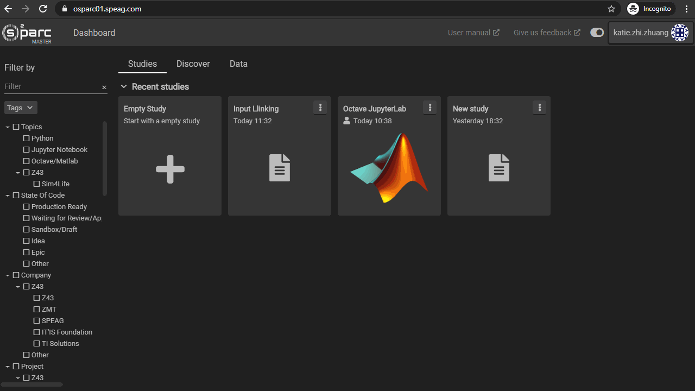

# Data Tab
The data tab allows you to browse the output files of all of your active pipelines in one place. This is most useful for downloading the data created on the online platform to your local computer.

In this tab, you will find a file tree with ```My Data/simcore.s3```. Expanding ```simcore.s3``` will display a folder for each of your studies with the title of that study. Expanding the folder of each study will allow you to access the data (outputs or notebooks) belonging to each service within that study. 

For Jupyter Lab services, **work.zip** is a zip file containing everything in your directory including notebooks, inputs and outputs while the **output_1.zip** contains only the files you have placed inside the ```outputs/output_1``` folder.

## Downloading Data
To download files:
1. Select the file you would like to download
2. Click the download button at the very bottom of the window

**Pro Tip: you may need to click the ```Reload``` button if the file has very recently been generated or modified

