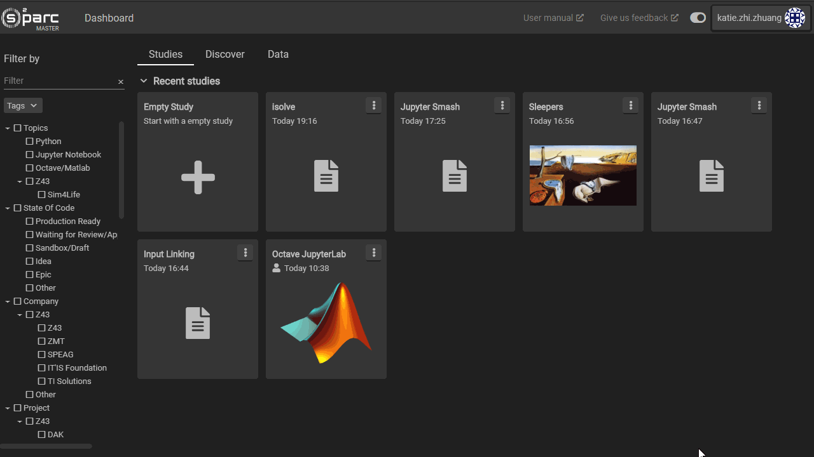

# Creating and Deleting Services

Services can be created in a study's **Workbench** by clicking anywhere in the empty space and selecting a service from the service catalog. When choosing a service, you may search for entries in the catalog using the search bar and for each service, can choose the version (e.g. for backcompatibility).

The following video demonstrates creating and deleting a service.

