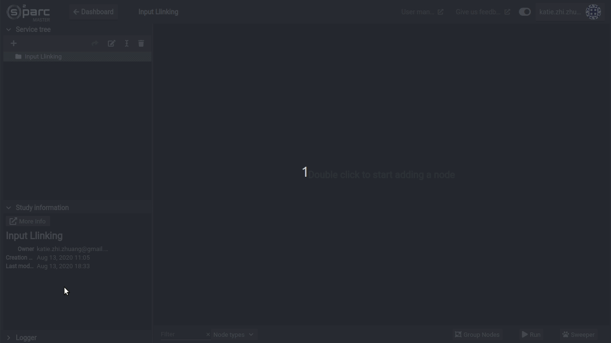
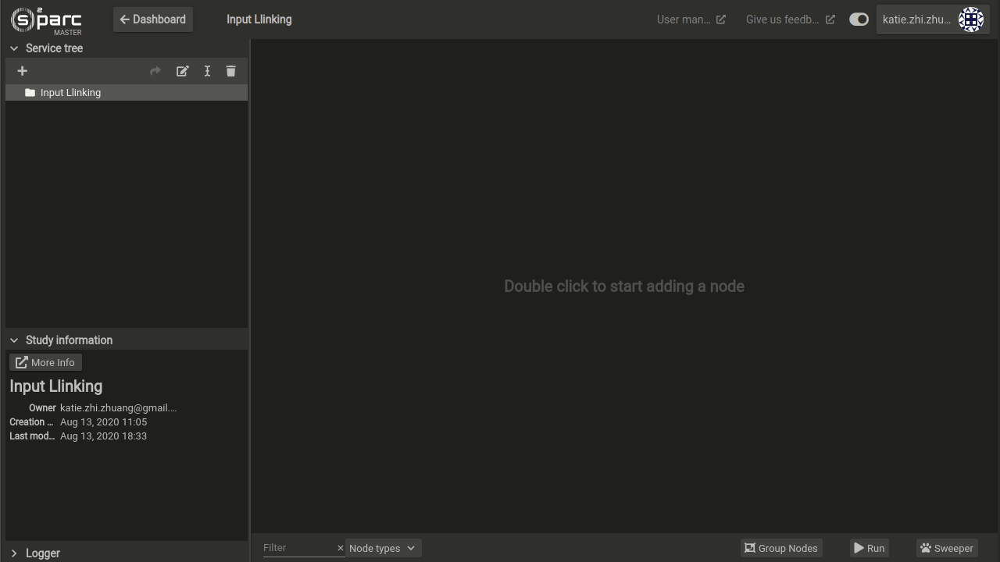

# File Picker
The **File Picker** service is one that allows you to upload files onto the online platform in order to use it as input to another service, such as **iSolve**. 

## Usage

To use this service in your study:
Drag and drop a file from your local file browser onto the workspace of your study - the file will be automatically uploaded into a **File Picker** service.




### Alternatively
1. Create the service by double-click any empty area in the workspace and choose the File Picker
2. Enter the service options by double-clicking the **File Picker**
3. Click the ```Add File``` button on the bottom right hand corner of the options
4. Choose a file from your local computer


**Note that the file will need to be mapped to the input field in the service using the File Picker's input**