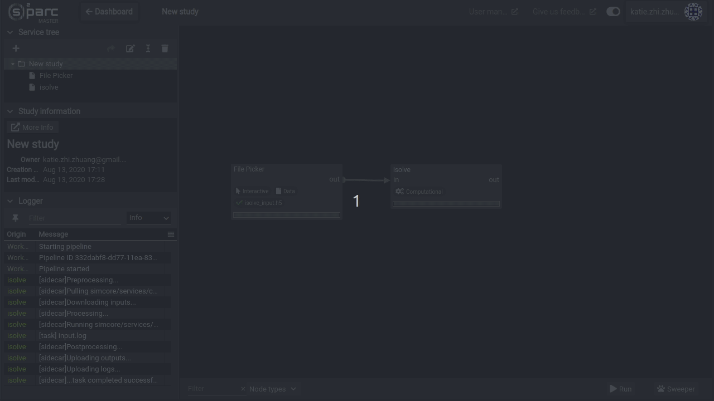

# iSolve

The iSolve service allows you to run Sim4Life solvers on **HDF5** files that were created in Sim4Life or from the **Jupyter smash** service. The advantage of using iSolve on the online platform is its access to large computational resources relative to your wimpy workstation (e.g. >700GB of RAM). 

### Inputs
The **HDF5** input file must be mapped to the input of the iSolve service by connecting the output port of the file supplier to the input port of the iSolve service and then mapping the appropriate file to iSolve's input field. The file should have the modeler and simulation configuration already defined. 

### Execution
To run iSolve on the mapped file input, click the Run button on the lower right hand corner of your workspace. Expanding the the logger will show progress and ```...task completed successfully``` when the execution is finished. 

The following short video shows:
1. Creating a File Picker service to upload a file
2. Uploading a file from your local computer
3. Mapping the file to the iSolve input field
4. Running the pipeline


### Outputs
The output of the iSolve service is another **HDF5** file that can be imported into Sim4Life for Postprocessing. You may download the file by entering the iSolve service (double-clicking on the service) and clicking on the ```Files``` button on the upper menu bar. 

