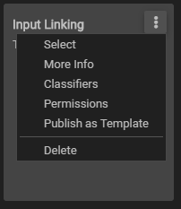
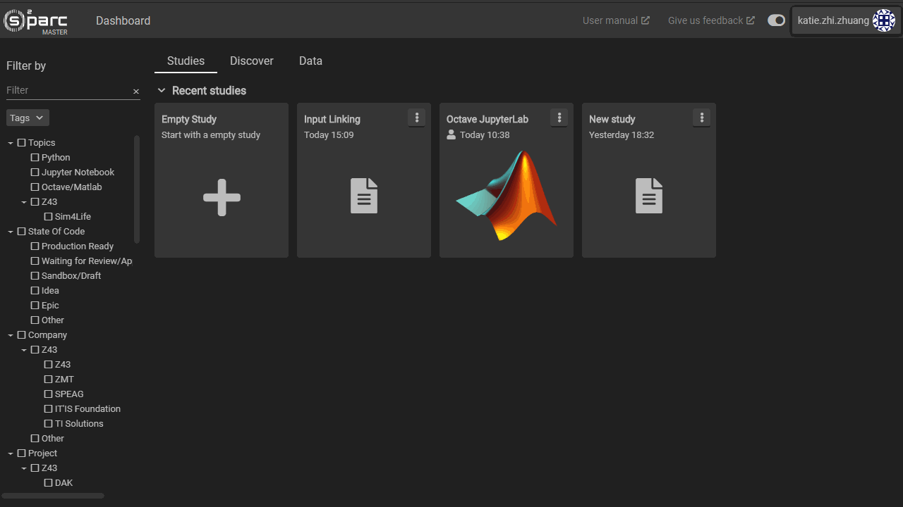

# Study Operations
A code project on the online platform is called "Study". Any study is accessible via the [Dashboard](../Dashboard.md) either in the ```Studies``` (which belong to or are shared with you) or the [Discover](../Discover.md) tab (for published templated studies).

There are a number of operations that are specific to studies, accessible by the three dot button at the upper right hand corner of each study.



These options are:
1. **Select:** allows you to select this study and/or others, primarily useful for deletion
2. **More Info:** allows you to view and edit metadata for a study including its title, description and icon
3. **Classifiers** allows you to assign classifiers (descriptors) for a study which can then be used for search and filtering using the filter tool on the [Dashboard](../Dashboard.md)
4. **Permissions** allows you view who the study is shared with and to add collaborators to the study
5. **Publish as Template** if selected, you will be allowed to create a copy of the study in its current state which will appear as a template study in the [Discover](../Discover.md) tab for users you share the template with.* 
6. **Delete** as you may guess, this will delete the particular study, with a confirmation popup

**Note that those users will be able to create a copy of that study for themselves. Any edits they make will not change the template. To share a study instance, see [Sharing a Study](../GeneralUsage/sharestudy.md)*

The following short video demonstrates a few operations that can be performed with studies. 


