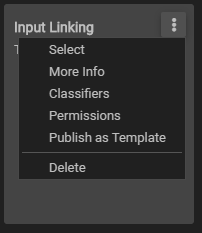

# Search and Filter

To make sure that Z43 projects are findable and reusable, the search and filter tool is available in the **Studies** and **Discover** tabs on the Dashboard. 

## Filter by Classifier
To filter by one of the available classifiers, simply check the box next to the appropriate classifier, currently based on Z43 projects. 

In the **Discover** tab, templates and studies have classfiers assigned by the publisher. Creating your own study from these templates will automatically assign the same classfier(s) to your copy of the study.

In your own **Studies** tab, studies can also be filtered by classifier. To assign a classifier to your own study, click on the three dots on the upper right hand corner of a study and choose the *Classifiers* option. 



## Search
You may also search using the search and filter tool by typing in a specific word or phrase. This will search through a study or service's metadata to find a match to your search terms. 

## Filtering and Searching
Filtering and searching are not independent so you may combine both strategies to find what you are looking for. For example, you may filter by ```Python``` and search for a user and the results will be the intersection of these two results

The following short video shows how to filter by classifier and assigning a classifier. 


