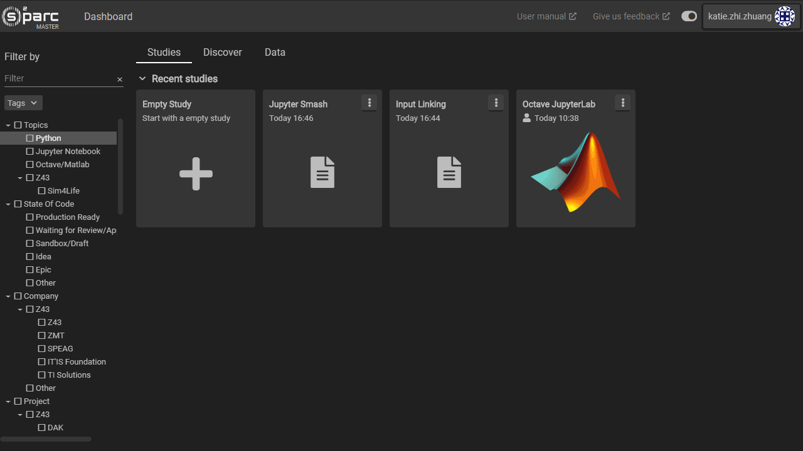

# Search and Filter

To make sure that Z43 projects are findable and reusable, the search and filter tool is available in the **Studies** and **Discover** tabs on the Dashboard.

## Filter by Classifier
To filter by one of the available classifiers, simply check the box next to the appropriate classifier, currently based on Z43 projects.

In the **Discover** tab, templates and studies have classfiers assigned by the publisher. Creating your own study from these templates will automatically assign the same classfier(s) to your copy of the study.

In your own **Studies** tab, studies can also be filtered by classifier. To assign a classifier to your own study, click on the three dots on the upper right hand corner of a study and choose the *Classifiers* option.


## Search
You may also search using the search and filter tool by typing in a specific word or phrase. This will search through a study or service's metadata to find a match to your search terms.

## Filtering and Searching
Filtering and searching are not independent so you may combine both strategies to find what you are looking for. For example, you may filter by ```Python``` and search for a user and the results will be the intersection of these two results

The following short video shows how to filter by classifier and assigning a classifier.




## Adding/Removing Classifiers

Every tree of classifiers belongs to a given group (i.e. Z43 group, osparc-dev group, etc). A user will see a new node with classifiers per every group he/she belongs to. Each of these groups is responsible of defining an *official* list of classifiers that are then approved by the system administrator (osparc team?) via the steps outlined below. They *cannot* be modified directly from the osparc GUI.

To define the **Z43 group's classifiers** there is a [curation workflow in place](https://git.speag.com/curated-data/classifiers). Any Z43 user can submit changes to the repository by
- either by [creating a new issue](https://git.speag.com/curated-data/classifiers/-/issues/new) or
- directly modifying the classifiers using the [web IDE](https://git.speag.com/-/ide/project/curated-data/classifiers/edit/master/-/)

In both cases, the changes start a review process that includes both automated validation of the changes (e.g. is all data and media required per classifer provided? does it follow group's naming conventions?, is it a duplicate? etc.) as well as a peer review of the submission.

If all reviews pass, the submission is accepted and the system automaticaly bundles all the information so it can be deployed in osparc by the system administrator. At that point, users will see the new tree of classifiers in the UI.

### Why a curation workflow?

Many of you are probably asking *why should we create a curation workflow for the Z43 classifiers?. Couldn't we simply create/modify them spontaneously?*

It is a fair question but in the case of **official classifiers** shared by many users, one needs to provide a more strict structure that:
1. Guarantees all submissions fulfill minimum agreed standards, i.e. information required is correct.
2. Facilitates consensus among the group users on the way studies are classified at Z43 group (reviews and approval are kept)
3. Keeps version history of all changes in the classifiers (can revert back and forward any time)
4. Simplifies and guarantees a reliable deployment of the outcome to the platform

