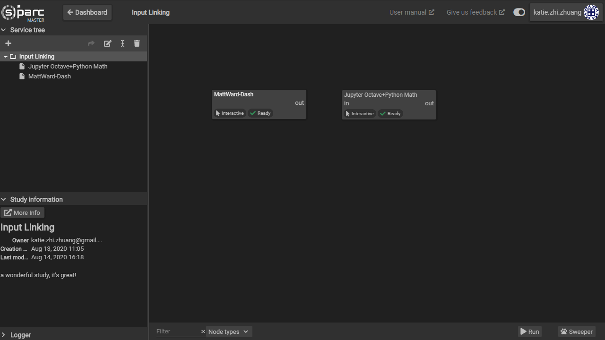

# Linking Services
In order to make files from one service available in another, the output of the first service must be mapped correctly to the input of the next. To achieve this:

1. The two services must be connected. To connect, click on the output port of ```out``` of the service providing files to the input port ```in``` of the next service, receiving the files. A dotted arrow will appear. 
    * You may connect the same output port to multiple services
    * Make sure that there is an output from the first service
    * You may disconnect two services by clicking on the arrow between them and clicking the unlinking button that will appear on the bottom right hand corner of the workspace.  

2. Enter into the the service receiving the file by double clicking on it.
3. From the inputs column, click and drag the file of interest and drop it into the appropriate input field of your service under **Settings**. 
    * This workflow is necessary when there are multiple files provided by the first service and/or multiple input fields in the consumer service.
    * If you would like to pass multiple files to e.g. a JupyterLab service, consider zipping the files
    * If the input fields are mapped, the dotted line between two services in the **Workspace** view should now be solid instead of dotted.
4. To map a different file, click ```Unlink``` in the input field and drag and drop a different file. 
    * Sometimes, it is necessary to click ```Retrieve``` in the upper right hand corner of the service UI.

The following short video shows linking and unlinking of service inputs/outputs.


