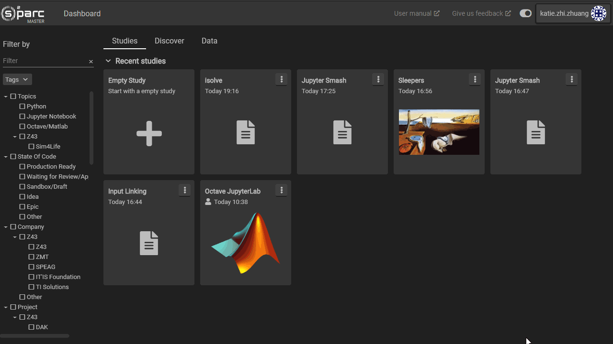

# Creating and Deleting Services

Services can be created in a study's **Workbench** by double-clicking anywhere in the empty space in the main (pipeline) window and then selecting a service from the service catalog. When choosing a service, you may search for entries in the catalog using the search bar. 

When you click on a service's card in the catalog, you will also have the option of selecting a specific version of that service in the ```Version``` field, which is a dropdown menu. This was implemented for backcompatability. The default service version will always be the most recent, or "latest". Clicking the ```Add```button on the bottom of the catalog popup will add the selected service to your study's **Workbench**.

To delete a study, select it by either clicking on the service module in the pipeline, or selecting it in the **Service Tree**, located at the top of the sidebar of your study's **Workbench**. Then, click the ```Delete``` button in the **Service Tree**.

The following video demonstrates creating and deleting a service.

