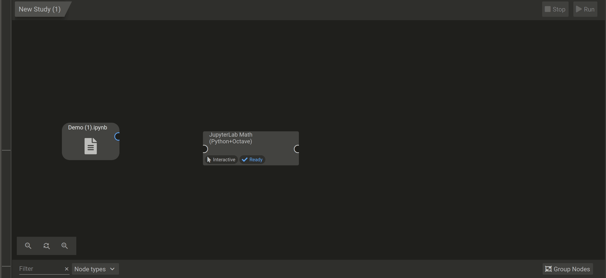

# Input and Output Ports in JupyterLab
If your JupyterLab service uses input files that come from a preceding node or service (as opposed to direct upload from your local computer), you will need to connect the preceding input to your JupyterLab service. This may be necessary, for example, if you are post-processing the results of computations from a collaborator's service. Likewise, you may want to pass the output files of your JupyterLab to a subsequent service. 


## Input Mapping From Other Services
To link an input from another service TO your JupyterLab, drag and drop the output port of that service to the input port of the JupyterLab. Then, within the JupyterLab UI, drag and drop the appropriate output file onto the ```input_file_N``` (where ```N``` is between 1 and 4) entry to map the file (see [Linking Services](GeneralUsage/MapInputs.md) for more details). The output file from the previous node will now appear in the folder ```inputs/input_N```. To access this file in your code, it will exist in the absolute path ```/home/jovyan/work/inputs/input_N/file_name.ext```, where ```N``` is the matching port from 1 to 4. If the code you are running is stored in the default folder of the JupyterLab, the relative path would be ```inputs/input_N/file_name.ext```.

**NOTE: ONLY the file that is mapped into the input_files field will be available to the JupyterLab service. If you do not map any files, the JupyterLab will not have access to anything coming from the previous node. To pass multiple files, they must be zipped first.**


## Output Transfer To Other Services
To allow transfer of output files FROM your JupyterLab to other nodes, either write, copy or move your output files to the ```outputs/output_N``` folder where ```N``` is between 1-4, since each JupyterLab has 4 possible output ports. Linking the output port of your JupyterLab service to the input port of the next service will then enable the next service to discover files in your ```output_N``` folder.

**Pro Tip: Notice that when your input/output ports are not mapped (two nodes are connected but files are not mapped) the arrow linking two services will be dashed instead of solid.**

