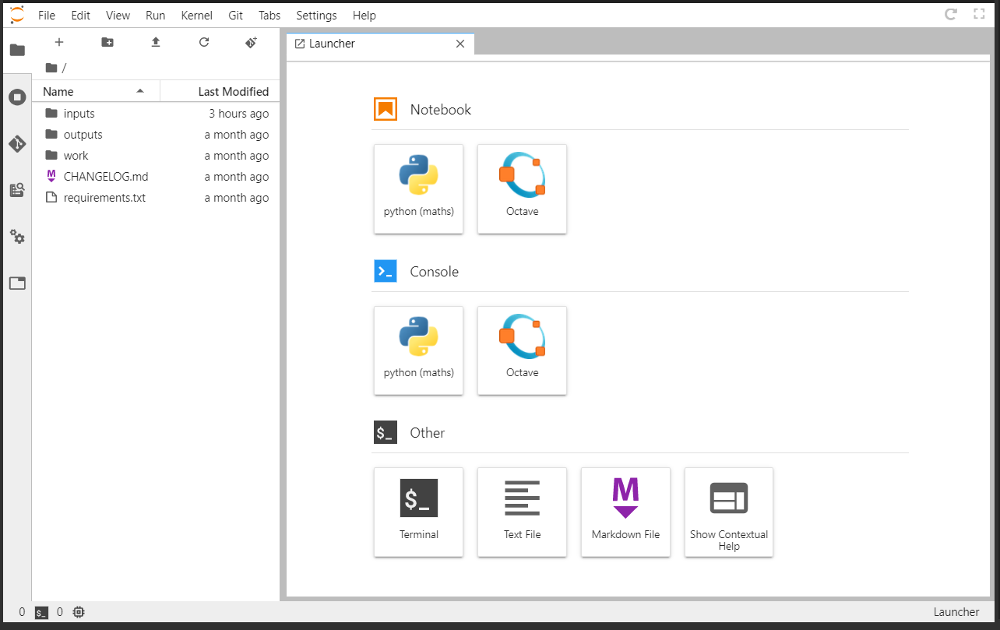

# JupyterLab Flavors

We offer two JupyterLab flavors for the Z43 community based on the needs of our colleagues. 

## Jupyter Smash
*Jupyter Smash* offers a ```smash (master)``` kernel which provides a Python interface with preinstalled Sim4Life modules. This service is meant to allow you to run your Sim4Life Python scripts directly on the online platform with only minor changes (see [Adpating Sim4Life Scripts](../../../GeneralUsage/adaptscripts.md)). A full tutorial using this service is described separately [here](.../../../Tutorials/Sim4LifeParallelPlate.md).

## Jupyter Octave+Python Math
This service gives you a choice of creating notebooks with either Octave or Python. The ```Python (maths)``` kernel has preinstalled modules for mathematical modeling and data analysis. The full list of preinstalled packages is available [here](https://git.speag.com/oSparc/sparc-internal/-/blob/master/services/jupyter-octave-python-math/kernels/python-maths/requirements.txt).

#### Switching Kernels within a Notebook
You may even change the kernel of a notebook from Python to Octave or vice versa in the middle of a notebook, but note that variables are not shared across kernels. To change the kernel associated to a given notebook, double click the notebook in the file tree on the left to ensure it is being actively viewed in the main window. Then, select "Kernel" from the menu at the top of the page and choose "Change Kernel...". This will open a window with a dropdown menu containing alternative kernel options.

