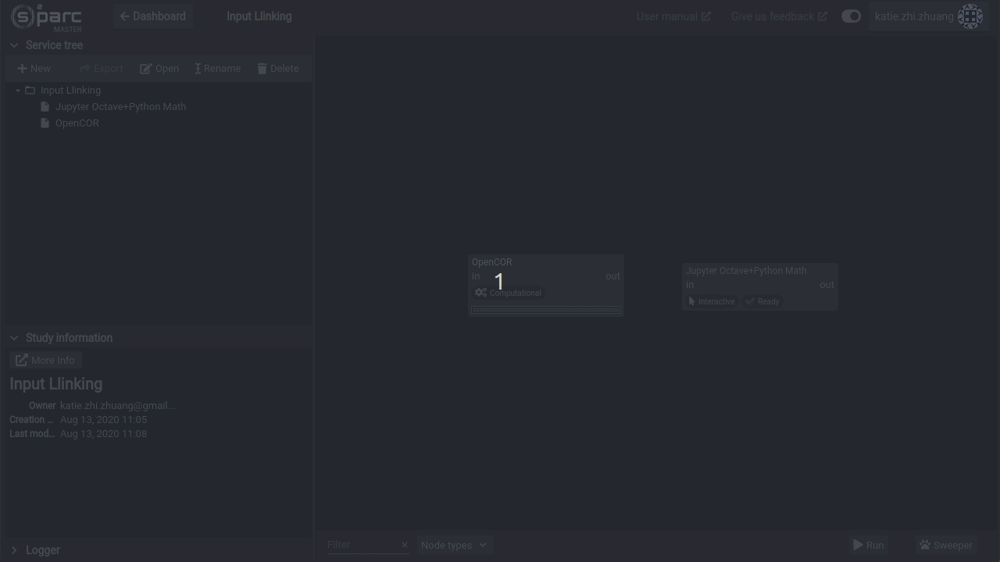
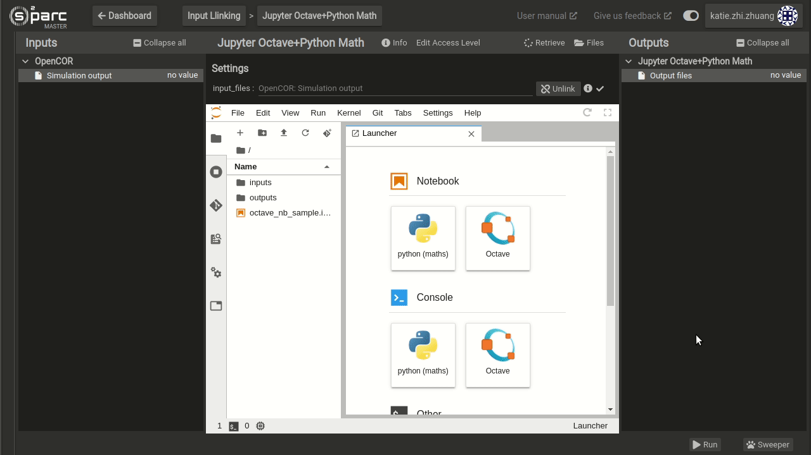

# Input and Output Ports in Jupyter Lab
If your Jupyter Lab service uses input files that come from a preceding node or service (as opposed to direct upload from your local computer), you will need to connect the preceding input to your Jupyter Lab service. This may be necessary, for example, if you are post-processing the results of computations from a collaborator's service. Likewise, you may want to pass the output files of your Jupyter Lab to a subsequent service. 

## Input Mapping From Other Services
To link an input from another service TO your Jupyter Lab, drag and drop the output port of that service to the input port of the Jupyter lab. Then, within the Jupyter Lab UI, drag and drop the appropriate output file onto the input_files entry to map the file (see [Linking Services](../../../GeneralUsage/MapInputs.md) for more details). The output file from the previous node will now appear in the folder ```inputs/input_1``` . 



*Note that ONLY the file that is mapped into the input_files field will be available to the Jupyter Lab service. If you do not map any files, the Jupyter lab will not have access to anything coming from the previous node. To pass multiple files, they must be zipped first.*

To access this file in your code, it will exist in the absolute path ```/home/jovyan/work/inputs/input_1/file_name.ext```

If the code you are running is stored in the default folder of the Jupyter Lab, the relative path would be ```inputs/input_1/file_name.ext```

## Output Transfer To Other Services
To allow transfer of output files FROM your Jupyter Lab to other nodes, either write, copy or move your output files to the ```outputs/output_1``` folder. Linking the output port of your Jupyter Lab service to the input port of the next service will then enable the next service to discover files in your ouput_1 folder.



**Pro Tip: Notice that when your input/output ports are not mapped (two nodes are connected but files are not mapped) the arrow linking two services will be dashed instead of solid.**