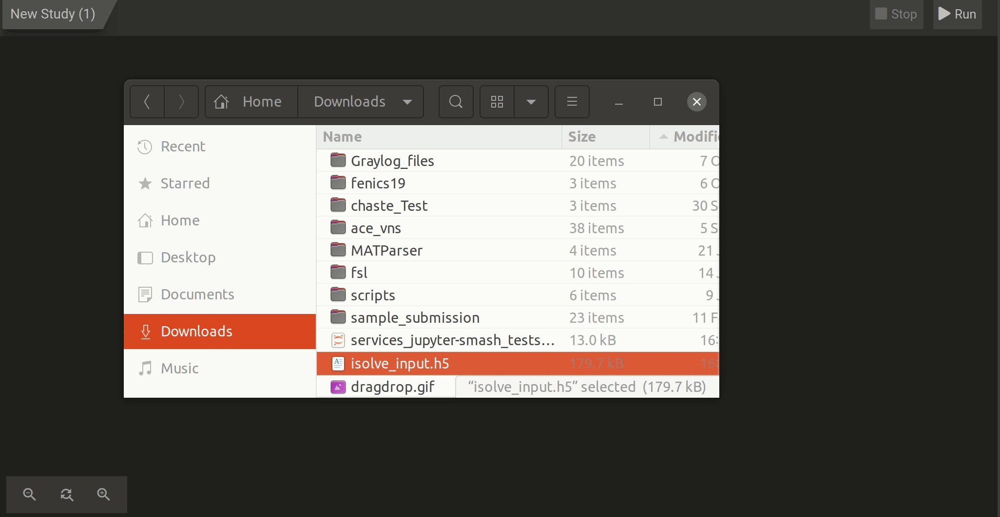

# Basic Tutorial: Platform Functionality

In this tutorial, you will learn the basics of setting up a study pipeline on the online platform, uploading files linking services together and executing the study.

## Steps
Before beginning the tutorial, you will need to download an **HDF5** file [here](https://git.speag.com/oSparc/z43-manual/-/blob/master/docs/Tutorials/input.h5).
1. Create a new study by clicking the Empty Study card in the **Studies** tab of your **Dashboard**.
2. Double click anywhere in the empty space in your pipeline workspace to access the **Service Catalog** and click on the **File Picker** service.
3. Access the service options by double-clicking the **File Picker**.
4. Click the ```Add File(s)``` button on the bottom right hand corner of the options.
5. In the popup file browser, choose the *isolve_input.h5* file you have downloaded. 
6. Click on the output port of ```out``` of the **File Picker** and with the mouse button held, drag and drop the arrow somewhere in the empty space of the pipleine workspace. A **Service Catalog** should appear.
7. From the **Service Catalog** find the **isolve** service card and double click on it to add it to your workbench.
8. The **File Picker** and **isolve** services should now be connected from **File Picker** ```out``` to **isolve** ```in``` with a dotted arrow, meaning that the file mapping between the services is not complete. To resolve this, double-click on the **isolve** service, which will bring you to the service's options.
9. From the **Input** column, there should be a **File** object, which is coming from the **File Picker**. Drag and drop this file into the input field of the isolve options, labeled ```input_file``. 
10. Return to the study's workbench by clicking on the button with name of the study, located at the very top of your window (by default this button will be ```New Study```). 
11. At the bottom right hand corner, click on the ```Run``` button to execute the pipeline. 
12. Expand the **Logger** subwindow (if collapsed) on the left side of the screen by clicking the right-facing chevron. When the pipeline is finished, you will see the message: 
```
...task completed successfully
``` 
13. Double-click the **isolve** service to again access its options. 
14. On the upper menu bar of the **isolve** service options, click on the ```Files``` button on the upper menu bar. 
15. Under **Node Files** you should see the output file of the **isolve** execution. Click it and click the ```Download``` button
16. Return to the **Dashboard** by clicking on the ```Dashboard``` button at the very top of the screen.

We can save this pipeline as a template so that when you would like to run **isolve** you may make a copy of the study using the template and upload a different file into the **File Picker** service without needing to set up the study again. 

17. Access your new study's options from the Dashboard by clicking on the three dot button on the upper right hand corner of the study's card. 
18. Choose the ```Publish as Template``` option
19. In the popup, choose the ```Private``` option so that you don't spam the rest of Z43 ;) 
20. The template will now appear as a **Template Study** in your **Discover** tab. 


The following video shows steps 1-9
