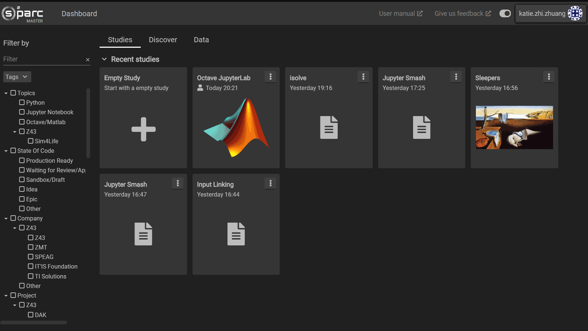

# Sim4Life Tutorial: Parallel Plate

One of the first tutorials in the Sim4Life manual is a project applying the Electro Static solver to evaluate the electric field between two metallic plates. Here, we will discuss how to implement the same tutorial on the online platform using the **Jupyter Smash** service. You will learn how to upload a script, run it, view results, and share the study with another user. Before beginning the tutorial, you will need to download an iPython notebook containing the parallel plate tutorial [**here**](https://git.speag.com/oSparc/z43-manual/-/blob/master/docs/Tutorials/services_jupyter-smash_tests_integration_assets_tutorial_emlf_parallel_plate.ipynb).

The original tutorial can be found [here](https://git.speag.com/simphony/Tutorials/-/tree/master/tutorials). We provide a slightly modified one for the online platform. To learn more about how to translate your Sim4Life scripts to work with the **Jupyter Smash** service, see [Adapting Sim4Life scripts to Jupyter Smash](../GeneralUsage/adaptscripts.md)

## Steps


You may download this video for easier viewing [here](https://git.speag.com/oSparc/z43-manual/-/blob/master/docs/_media/startsmash.mp4)
1. Create a new study by clicking the ```Empty Study``` card in the **Studies** tab of your **Dashboard**.
2. Double click anywhere in the empty space in your pipeline workspace to access the **Service Catalog** and click on the **Jupyter Smash** service.
3. Double click on the newly-created **Jupyter Smash** service to access the JupyterLab UI.
4. On the side panel of the UI, click on the ```Upload Files``` icon .
5. Browse to where you have downloaded the tutorial notebook, choose it and click ```Open```
6. The notebook should now be uploaded into the JupyterLab and visible in the JupyterLab sidebar under the File tab . Double click on the file to open it.
7. The code is divided into sections based on the Sim4Life workflow steps. To execute each section of code, click that section and press the ```Run the selected cells and advance``` button  on the notebook options menu on the top of the notebook window. 
8. When you arrive at any rendering cell, you may click the refresh button in order to interact with the embedded viewer (e.g. zoom, pan, rotate)
9. When you are finished running the tutorial, save your results. 
10. Go back to your **Dashboard** by clicking on ``Dashboard`` at the very top left of the screen.
11. Your study is currently named with the default *New Study* name but you can rename it to something more appropriate by clicking on the three dots on the top right of the study's card, and selecting ```More Info```. In the popup, click the ```Edit``` button on the bottom. 
12. Rename the study and provide a nice description if you like. The **Thumbnail**  field accepts URL's for images. When you are done, click ```Save```.
13. You may now share your study if you wish, by again accessing the study options by clicking on the three dots on the upper right hand corner of the study's card, and selecting ```Permissions```. In the ```Members``` dropdown button, you may choose your best friend at Z43 to share your wonderful new study with. If you click ```Add```, your study will appear on their **Dashboard** on the **Studies** tab. 

